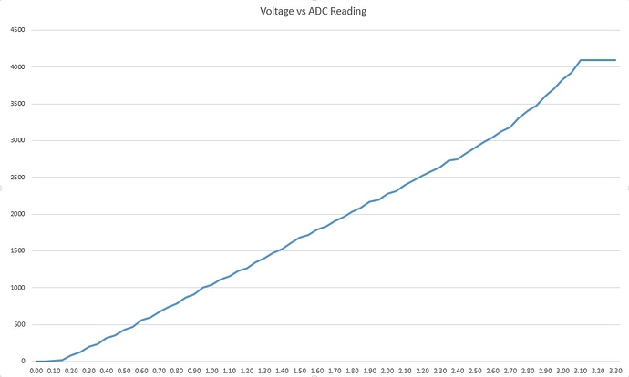

# PRACTICA 5: BUS I2C

En aquesta practica aprenem a connectar un dispositiu I2C a través de la nostra placa ESP 32.

## Exercici 1: Reconeixament de I2C

En la capçelera hi trobem la lliberia Wire que ens permetrà fer la connexió bus I2C. 
En el setup només s'incicilaitza la coneixó amb el serial port. 
```cpp

#include <Arduino.h>

#include <Wire.h> 
 
void setup(){

  Wire.begin();
 
  Serial.begin(9600);
  while (!Serial);             // Leonardo: wait for serial monitor
  Serial.println("\nI2C Scanner");

}
 ```
És en el loop on trobem la part important del codi. 
Primer definim dues variables tipus *byte* que ens serviràn per guardar l'adreça del dispositiu I2C i el return de la funció *wire.endTransmission()*.
Llavors s'incialitza el contador de dispositius a 0. 
```cpp
void loop(){

  byte error, address;
  int nDevices;
 
  Serial.println("Scanning...");
 
  nDevices = 0;

  ```
Tot seguit entrem en un bucle de 1 a 127 que ens permetrà detectar qualsevol dispositiu I2C. 
La funció *Wire.endTransmission()* retorna un byte amb valor de 0 a 4 segons les següents situacions:
* 0: éxito
* 1: datos demasiado largo para caber en la memoria intermedia de transmisión
* 2: NACK recibido en transmisión de dirección
* 3: recibido NACK en transmisión de datos
* 4: otro error
Per tant, si *Wire.beginTransmission(address)* troba una connexió llabors el byte *error* serà 0 i es mostrarà per pantalla l'adreça del dispositiu detectat. 
Si *error*=4 llabors s'informarà de que hi ha hagut un error en la connexió, i si no és cap d'aquestes opcions es mostrarà el missatge de que no s'ha trobat cap dispositiu I2C. 

Cal esmentar que un cop executat el loop, **el dispositiu I2C NO es manté connectat a la micro** ja que s'ha realitzat la operació de finalitzar la transmissió. 

  ```cpp

  for(address = 1; address < 127; address++ ){

  // The i2c_scanner 
  // the Write.endTransmisstion to see if
  // a device did acknowledge to the address.
    Wire.beginTransmission(address);
    error = Wire.endTransmission();
 
    if (error == 0)
    {
      Serial.print("I2C device found at address 0x");
      if (address<16)
        Serial.print("0");
      Serial.print(address,HEX);
      Serial.println("  !");
 
      nDevices++;
    }
    else if (error==4)
    {
      Serial.print("Unknown error at address 0x");
       if (address<16)
        Serial.print("0");
        Serial.println(address,HEX);
    }    
}
  
if (nDevices == 0)
  Serial.println("No I2C devices found\n");

else
  Serial.println("done\n");
  delay(5000);           // wait 5 seconds for next scan
}
```

En cas de connexió correcte la sortida al port serie hauria de ser així (on en lloc d'aparèixer 3C sortiria l'adressa del teu dispositiu I2C):

```
Scanning...
I2C device found at address 0x3C  ! 
done
```

## Exercici 2: Voltímetre digital

 

En aquest exercici hem fet el muntatge d'un voltímetre digital.

Per a fer-ho hem fet servir part del codi de la Pràctica 1 on obteníem la mesura de tensió des d'un pin ADC i ho hem convinat amb la pantalla gràcies a la connexió de busos I2C.

### **El codi:**

* Capçalera
Aquí hem introduit les llibreríes ja creades pel display. Aquestes son *Adafruit_GFX.h* i *Adafruit_SSD1306.h* que les he trobat sense problemes al repositori de PlatformIO. 

Aquí definim les dimensions del nostre display i l'inicialitzem. 
També definim el pin de lectura ADC. 

```cpp
#include <SPI.h>
#include <Wire.h>
#include <Adafruit_GFX.h>
#include <Adafruit_SSD1306.h>
 
// Definir constantes
#define ANCHO_PANTALLA 128 // ancho pantalla OLED
#define ALTO_PANTALLA 64 // alto pantalla OLED
 
// Objeto de la clase Adafruit_SSD1306
Adafruit_SSD1306 display(ANCHO_PANTALLA, ALTO_PANTALLA, &Wire, -1);


int IN=4;

```
* *Setup* 

Primer de tot inicialitzem la connexió amb el port Serie per tal de saber si s'ha pogut o no inicialitzar la connexió amb la pantalla. 
Tot seguit s'esborra el contingud de la pantalla.

Per tal de poder escriure-hi s'ha de definir el tamany de text [en pixels] i el color de la lletra (tot i que la pantalla només permet visualitzar uns colors establers, si es prescindeix d'aquesta configuració no es visualitzarà res). 

Tot seguit procedim a impirmir al display la informació que volguem, imprimint-la des del punt x,y que volguem amb la funció *display.setCursor(x, y)*.


```cpp

void setup() {
#ifdef __DEBUG__
  Serial.begin(9600);

  Serial.println("Iniciando pantalla OLED");
#endif
 
  // Iniciar pantalla OLED en la dirección 0x3C
  if (!display.begin(SSD1306_SWITCHCAPVCC, 0x3C)) {
#ifdef __DEBUG__
    Serial.println("No se encuentra la pantalla OLED");
#endif
    while (true);
  }
 
  // Limpiar buffer
  display.clearDisplay();
  display.setTextSize(1);

  display.setCursor(7, 0);
  display.setTextColor(SSD1306_WHITE);
  display.println("Lectura de voltaje:");
  
  display.setTextColor(SSD1306_WHITE);
  display.setCursor(0,20);
  display.println("Los datos que se mostraran a continuacion tienen un error de hasta un 10% aproximadamente.");
  display.display();
  delay(15000);
}
 
 ```
* *Loop*

En aquest espai és on es desenvolupa la funcionalitat de voltímetre. 

En la variable *measure* hi guardem el valor de la conversió Analogic-Digital. La ESP 32 converteix el voltatge a un valor de 0 a 4095. 
La conversió, però, no és 100% lineal :




Per simplificar la reconversió hem estimat que la tendencia és perfectament lineal. 
Així dons, aconseguim el valor en volts de la seguent manera: *volts=measure*3.3/4095;*
Això provoca que el valor tingui un marge d'error força significatiu. 

Les següents linies utilitzen el mètode explicat en el *Setup* per a mostrar les dades de la lectura del voltatge del LED en el display.
Al voltatge s'actualitzarà cada segon. 

```cpp
void loop() {
  
  
  int measure;
  float volts;
  
    measure=analogRead(IN);
    Serial.println(measure);

    volts=measure*3.3/4095;

    display.clearDisplay();
    display.setTextSize(1);
    display.setTextColor(SSD1306_WHITE);
    display.setCursor(7, 0);
    display.println("Lectura de tension:");

    display.setTextSize(3);
    display.setTextColor(SSD1306_WHITE);
    display.setCursor(7, 25);   
    display.print(volts);
    display.println(" V");
    display.display();
    delay(1000);


}
```

* Codi complert
Ajuntant totes les parts el codi final és el següent.

```cpp

#include <SPI.h>
#include <Wire.h>
#include <Adafruit_GFX.h>
#include <Adafruit_SSD1306.h>
 
// Definir constantes
#define ANCHO_PANTALLA 128 // ancho pantalla OLED
#define ALTO_PANTALLA 64 // alto pantalla OLED
 
// Objeto de la clase Adafruit_SSD1306
Adafruit_SSD1306 display(ANCHO_PANTALLA, ALTO_PANTALLA, &Wire, -1);


int IN=4;

void setup() {
#ifdef __DEBUG__
  Serial.begin(9600);
  delay(100);
  Serial.println("Iniciando pantalla OLED");
#endif
 
  // Iniciar pantalla OLED en la dirección 0x3C
  if (!display.begin(SSD1306_SWITCHCAPVCC, 0x3C)) {
#ifdef __DEBUG__
    Serial.println("No se encuentra la pantalla OLED");
#endif
    while (true);
  }
 
  // Limpiar buffer
  display.clearDisplay();

  display.setCursor(7, 0);
  display.setTextColor(SSD1306_WHITE);
  display.println("Lectura de voltaje:");
  display.setTextSize(1);
  display.setTextColor(SSD1306_WHITE);
  display.setCursor(0,20);
  display.println("Los datos que se mostraran a continuacion tienen un error de hasta un 10% aproximadamente.");
  display.display();
  delay(15000);
}
 
void loop() {
  
  
  int measure;
  float volts;
  
    measure=analogRead(IN);
    Serial.println(measure);

    volts=measure*3.3/4095;

    display.clearDisplay();
    display.setTextSize(1);
    display.setTextColor(SSD1306_WHITE);
    display.setCursor(7, 0);
    display.println("Lectura de tension:");

    display.setTextSize(3);
    display.setTextColor(SSD1306_WHITE);
    display.setCursor(7, 25);   
    display.print(volts);
    display.println(" V");
    display.display();
    delay(1000);


}

```

## Comprovació i conclusió

Per tal de veure si el programa y muntatge tenia éxit he decidit comprovar amb un tester el voltatge real del díode LED. 

Com es pot observar en la següent imatge, el voltatge obtingut a través d'un aparell de mesura és superior al obtingut a través del nostre muntatge. 


Això ja ho havíem previst ja que la conversió ADC no és lineal. 

Gràcies a aquesta practica he aprés a com controlar un display i adonar-me de que pot ser de gran ajuda en projectes futurs. Crec que es pot ser molt útil per tal de donar un bon acabat a un projecte. 


